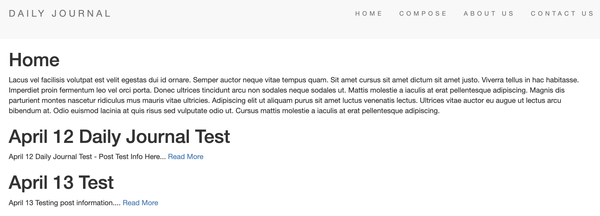

# Daily Journal Blog

This project is a daily website blog. This uses Node.js, Express.js, EJS, MongoDB, Mongoose, Lodash, Body-Parser, and DOTENV. In short summary, you can compose a daily post which will then be stored on the backend database.

---

## Homepage

The homepage has some static writing along with every other post stored in the MongoDB. You can access the homepage via "http://localhost:3000/" url or clickling the "HOME" option in the navigation bar. The posts will show from oldest to newest and have a summary of 100 characters. Each post will also have a hyperlink which will take the them directly to that post.

The posts will show from oldest to newest and have a summary of 100 characters. Each post will also have a hyperlink which will take the them directly to that post.

---

## Compose Post

To compose a new daily blog post navigate to the compose messsage page at "http://localhost:3000/compose" url or click "COMPOSE" option in the navigation bar. This will then take you to the compose page where you can select a title and message for your post.

---

## About Page

There is an about page which can be accessed by going to "http://localhost:3000/about" or clicking the "ABOUT US" link in nav bar. Here you can update more info about you or your blog.

---

## Contact Page

There is a contact page which can be accessed by going to "http://localhost:3000/constact" or clicking the "CONTACT US" link in nav bar. Here you can provide the best method for you to be contacted.

---

## Header Nav Bar

The header nav bar for daily journal has options to go to "HOME", "COMPOSE", "ABOUT US", "CONTACT US". When hovering over the options it will change color.

---

## Footer Bar

The footer bar changes up the color slightly and can be adjusted to whatever you like.

---

### .env

You will notice the .env_sample file. This is an example file used to store your personal MongoDB Atlas user and cluster info. You will need to create your own .env file with this info provided.
